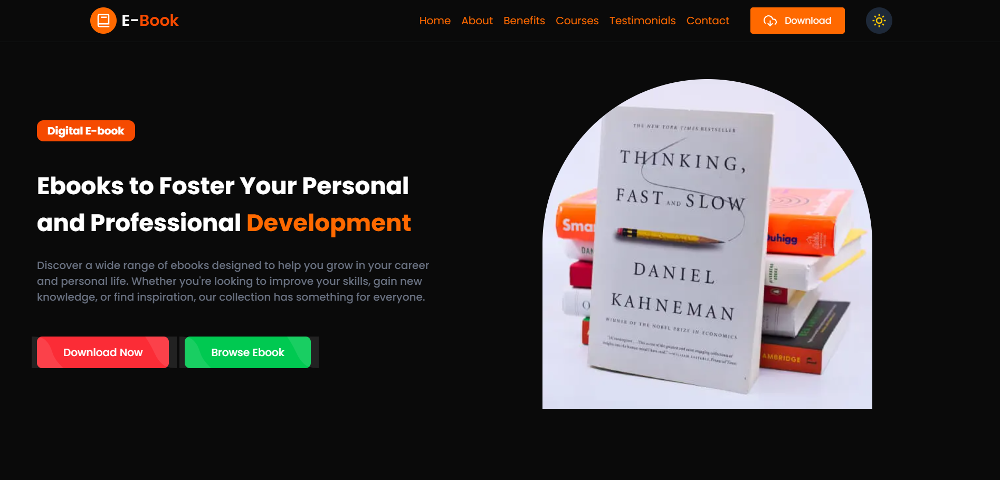

# 📘 E-Book Landing Page

A fully responsive, dark-mode-ready digital e-book landing page built with **Next.js**, **Tailwind CSS**, and **TypeScript**. This modern, high-performance website promotes digital products (ebooks) and features interactive sections like pricing plans, reviews, benefits, and best sellers.

<p align="center">
  
  
</p>


---

## 📚 Table of Contents

- [Demo](#demo)
- [Built With](#BuiltWith)
- [Features](#features)
- [Installation](#installation)
- [Components Overview](#components-overview)
- [Contributors](#contributors)
- [Contact](#-contact)  
---

## 🚀 Demo

[Live Link](https://e-book-dieqnxlnl-amrashraf15s-projects.vercel.app/)

---
## 🛠 Built With

-   
-   
-   
-   
-   
-   
-   
-   
-   
-   
- 


---

## ✨ Features

- 📱 **Responsive Design** (mobile-first, fluid layouts)
- 🌗 **Dark/Light Theme Toggle** using `next-themes`
- ⚙️ Modular, Reusable **React Components**
- 🎯 Scroll animations via AOS
- 📈 Sections for: Hero, About, Benefits, Pricing, Reviews, and Best Sellers
- 🧾 Testimonial Carousel with `react-multi-carousel`
- 🧭 Mobile and Desktop Navigation Bars
- ⬆️ Scroll-to-top FAB
- ⚡ Optimized with `next/image` for fast performance

---
### 1. Clone the Repository  
   ```sh
   git clone https://github.com/yourusername/ebook-landing-page.git
   cd ebook-landing-page
   ```
2. Install dependencies
   ```sh
    npm install
   ```
3. Run the development server
  ```sh
    npm run dev
   ```

---

## 🧩 Components Overview

| Component       | Description                                      |
|-----------------|--------------------------------------------------|
| `Navbar`        | Sticky top nav, responsive with theme toggle     |
| `Hero`          | Landing banner with image and CTAs               |
| `About`         | Summary of the book's value                      |
| `Benefits`      | Highlight key ebook advantages                   |
| `BestSelling`   | Book showcase slider                             |
| `Price`         | Tiered pricing plan cards                        |
| `Reviews`       | Client feedback with carousel                    |
| `Footer`        | Contact, social, links                           |
| `ThemeToggle`   | Light/dark switcher                              |
| `ScrollToTop`   | Animated scroll-to-top button                    |
| `Sheet`, `Button` | UI primitives based on Radix & Tailwind        |


---

## Deploy on Vercel

The easiest way to deploy your Next.js app is to use the [Vercel Platform](https://vercel.com/new?utm_medium=default-template&filter=next.js&utm_source=create-next-app&utm_campaign=create-next-app-readme) from the creators of Next.js.

Check out our [Next.js deployment documentation](https://nextjs.org/docs/app/building-your-application/deploying) for more details.

---

## 📬 Contact

**👤 Developer:** Amr Ashraf  
**📧 Email:** [amrashraf1592@gmail.com](mailto:amrashraf1592@gmail.com)  
**🐙 GitHub:** [amrashraf15](https://github.com/amrashraf15)

---

